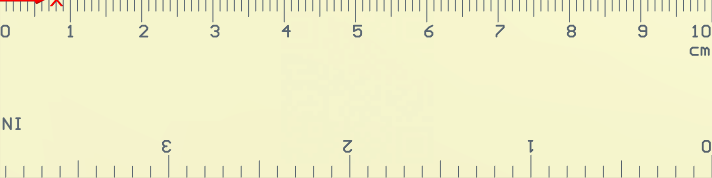

# PCB_RULE
仿制 PCB 直尺 10CM

## 1.介绍说明
> 目录结构说明

一级目录 | 二级目录 |说明 
-|-|-
01_PCB_Project |  | PCB工程目录
-| PCB_Project.PrjPcb | PCB工程项目文件(使用AD19打开)
-| PCB_RULE.PcbDoc | PCB rule 文件

>正面图

>反面图

## 2.特性说明

整体长度 **10CM** 宽 **2.5CM** 适合PCB打样（建议 厚度1.0，白色油漆），推荐 [嘉立创](https://www.sz-jlc.com/)进行打样**5**元内搞定

目前支持 正面显示 厘米和英寸显示，因为整体宽度和高度的限制，只能做到 10CM，和接近 4 英寸(4000mil)

>换算关系为 1CM = 10mm 1IN = 1000mil

## 3.FQA

### 3.1 

F: 为什么做这个

A: 因为[嘉立创](https://www.sz-jlc.com/)5元包邮（10CM * 10CM 5片以下）,本着薅羊毛心态（闲的蛋疼）去画个板子，
这个板子只要字符层(Top overlay 和 bootom overlay),不涉及其它层，非常简单，这个后续可以做PCB书签使用

### 3.2

F: 为什么把刻度放在字符层(容易磨损)，不做出露金的效果呢？

A: 穷

### 3.3

F: 其它淘宝PCB尺子功能好多啊，还带元器件各种封装测量，线宽测试

A: 没有必要，留白才是最棒的，加了这些破坏尺子美感
